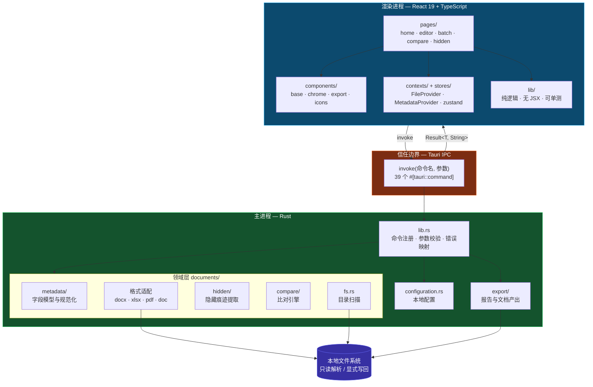
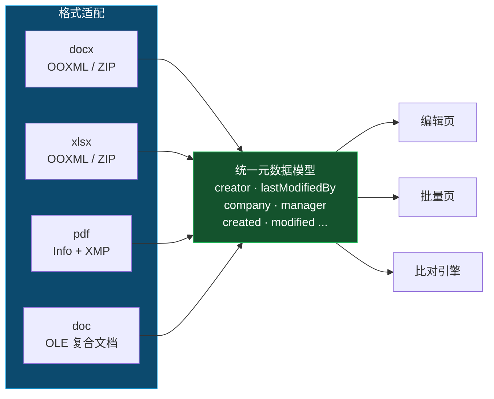
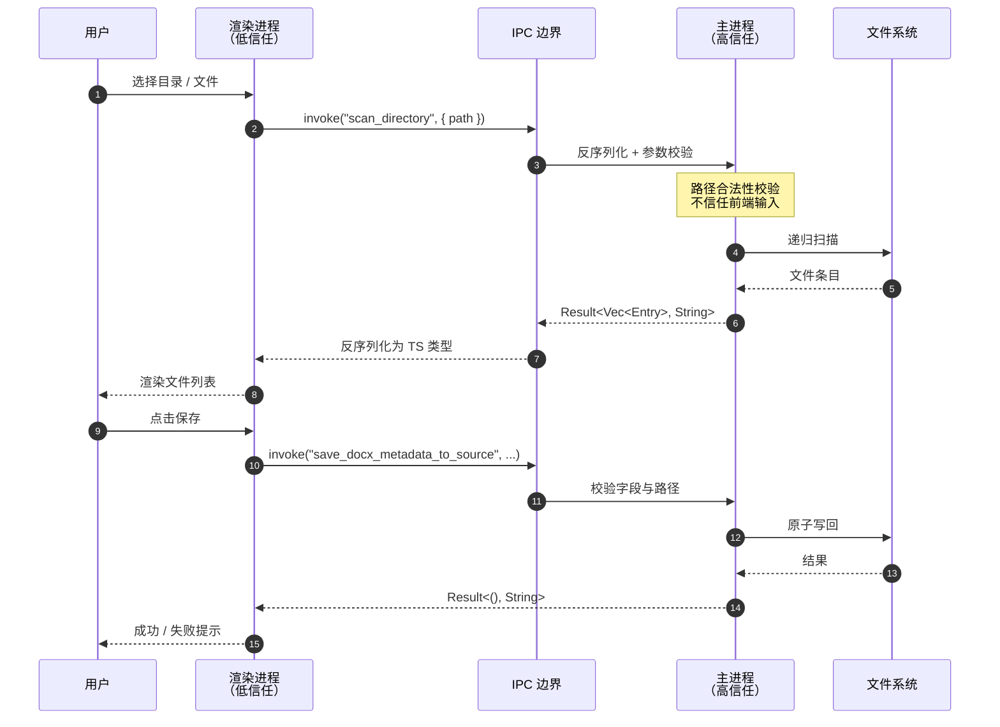

# 系统架构

## 定位

Office Metadata Editor 是一个**本地优先**的桌面工具，用于查看、编辑、批量清理 Office / PDF 文档的元数据，并对多主体投标文件做元数据交叉比对，产出**风险线索**。

关键约束：所有文档解析与写回都在本地完成，不上传任何文件。

## 分层架构

## 模块职责

### 渲染进程（`src/`）

| 目录 | 职责 | 约束 |
|------|------|------|
| `pages/` | 路由级页面，负责编排与交互 | 只做编排，算法下沉到 `lib/` |
| `components/` | 跨页复用的展示组件 | 样式用 CSS Modules 隔离 |
| `lib/` | 纯逻辑：筛选、排序、导出格式化 | 不含 JSX，可脱离 React 单测 |
| `contexts/` | 文件与元数据的读写上下文 | 跨页共享的会话态 |
| `stores/` | zustand 全局状态 | 仅存放真正跨页的状态 |
| `types/` | 与 Rust 对齐的 TS 类型 | 字段名 camelCase，两侧严格一致 |

### 主进程（`src-tauri/src/`）

| 模块 | 职责 |
|------|------|
| `lib.rs` | 命令注册、setup、插件初始化。只做校验 + 委托 + 错误映射 |
| `documents/metadata/` | 元数据字段的统一模型与规范化 |
| `documents/compare/` | 比对引擎（详见 [03-比对引擎](./03-比对引擎.md)） |
| `documents/hidden/` | 批注作者、修订作者、XMP 创建者等隐藏痕迹提取 |
| `documents/fs.rs` | 目录递归扫描与文件筛选 |
| `export/` | 报告导出（docx 等） |
| `configuration.rs` | 本地配置读写与覆盖 |

## 格式适配层

四种格式各自实现「解析 / 写回源文件 / 另存 / 批量清理」四组能力，对上暴露统一的元数据模型。

`docx` / `xlsx` 走 OOXML：ZIP 容器内改写 `docProps/core.xml` 与 `docProps/app.xml`。
`pdf` 走 Info 字典与 XMP 元数据流。
`doc` 走 OLE 复合文档的 SummaryInformation 流。

新增格式的成本 = 实现这四组能力 + 映射到统一模型，上层页面与比对引擎无需改动。

## 进程与信任边界

边界规则：

- 前端**不能**直接访问文件系统、进程、网络，一切经 `invoke` 调用已授权命令。
- 所有来自前端的参数在 Rust 命令内重新校验（类型、范围、路径安全）。
- capability / permission 仅授予必要命令与最窄 scope。
- 敏感判定（风险定级）在 Rust 侧完成，前端只做呈现，避免被篡改。

## 技术栈

| 层 | 选型 |
|----|------|
| 桌面框架 | Tauri v2 |
| 渲染层 | React 19 + TypeScript（strict） |
| 构建 | Vite + Bun |
| 核心逻辑 | Rust |
| 校验 | oxlint + `tsc --noEmit` + `cargo clippy` |

## 设计原则

1. **本地优先** — 不联网、不上传，文档留在用户机器上。
2. **单一入口** — 每个能力只有一处实现（OOXML 读写、ZIP 解包、目录扫描等）。
3. **薄命令层** — `#[tauri::command]` 只做校验 + 委托 + 错误映射。
4. **契约对齐** — 命令名与字段名两侧严格一致，禁止漂移。
5. **线索非结论** — 比对产出「线索 / 疑似 / 需复核」，不做违规定性。

## 相关文档

- [02-数据模型](./02-数据模型.md) — 核心数据结构
- [03-比对引擎](./03-比对引擎.md) — 比对算法细节
- [05-IPC契约](./05-IPC契约.md) — 命令清单
