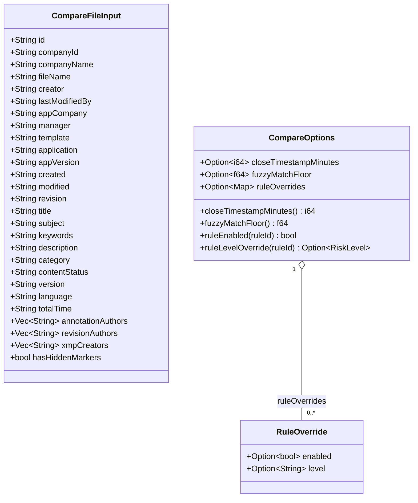
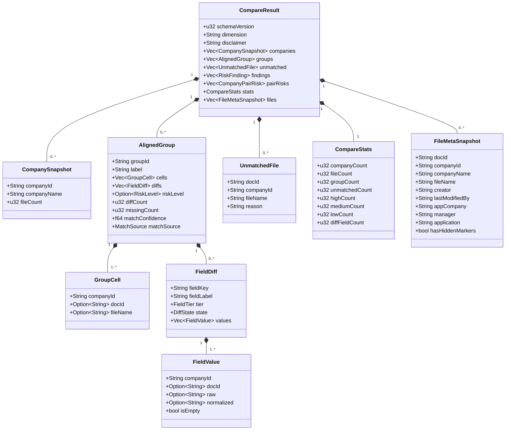
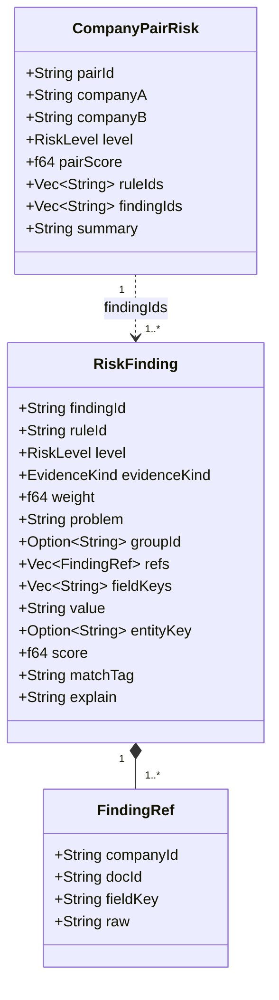
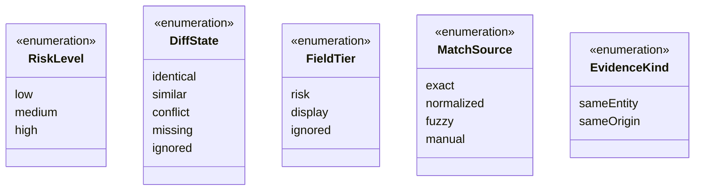
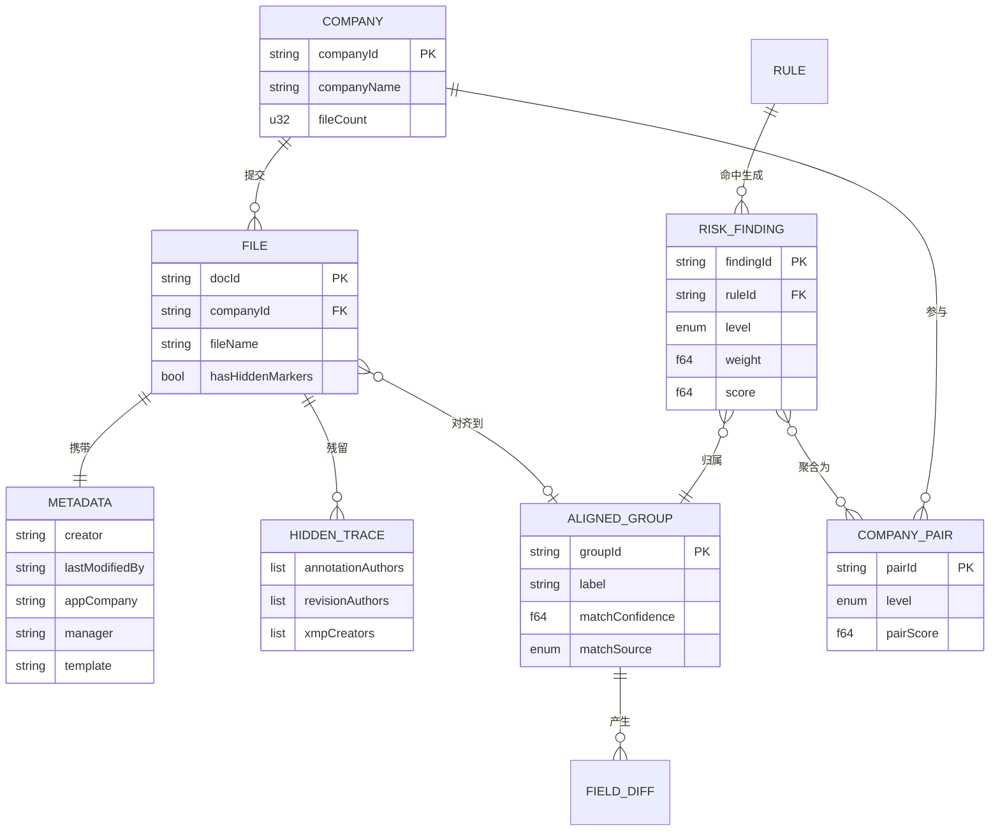

# 数据模型

所有跨 IPC 的结构均以 `serde(rename_all = "camelCase")` 序列化，Rust 侧 `snake_case` 字段在前端呈现为 `camelCase`。字段名两侧严格一致，禁止漂移。

## 比对引擎数据模型

### 输入模型

默认值：`closeTimestampMinutes = 10`（最小 0），`fuzzyMatchFloor = 0.3`（钳制到 0.0~1.0）。

前三组 `Vec<String>` 字段（`annotationAuthors` / `revisionAuthors` / `xmpCreators`）来自隐藏痕迹提取，为「同一主体」提供补充证据。

### 输出模型

`dimension` 固定为 `"cross-company"`。`disclaimer` 承载合规声明，随结果一并下发，确保导出的报告始终带有「线索非结论」的说明。

`matchConfidence` 保留 3 位小数，`pairScore` 保留 2 位小数，均在 Rust 侧完成舍入，避免前后端浮点呈现不一致。

### 风险线索模型

`findingId` 形如 `f0001`，`pairId` 形如 `{companyA}__{companyB}`，`groupId` 形如 `g0001`。

`explain` 为人类可读的判定依据，`matchTag` 标记匹配方式，二者共同支撑「可复核」——审核人能看到线索的来源而非黑箱结论。

### 枚举

`RiskLevel` 实现了 `Ord`，序为 `low < medium < high`，因此组级风险可直接取成员线索的最大值。

`FieldTier` 决定字段参与度：`risk` 参与规则判定，`display` 仅呈现差异，`ignored` 完全跳过。

`EvidenceKind` 区分两类证据语义：
- `sameEntity` — 指向同一个人 / 同一主体（作者、管理者、单位、批注者）
- `sameOrigin` — 指向同一来源 / 同一制作环境（模板、时间邻近、软件指纹）

## 领域关系总览

## 契约约束

1. **命名对齐** — Rust `snake_case` ↔ TS `camelCase`，由 serde 自动转换，禁止手写映射层。
2. **版本化** — `schemaVersion` 当前为 `1`，结构破坏性变更须递增。
3. **可选性显式** — Rust `Option<T>` ↔ TS `T | null`；`skip_serializing_if` 的字段（如 `entityKey`）在 TS 侧为可选属性。
4. **枚举小写** — 所有枚举以 `lowercase` 或 `camelCase` 序列化为字符串字面量，TS 侧用联合类型 + `as const` 而非 `enum`。
5. **数值精度** — 浮点在 Rust 侧完成舍入后再序列化。

## 相关文档

- [03-比对引擎](./03-比对引擎.md) — 这些模型如何被生产出来
- [05-IPC契约](./05-IPC契约.md) — 模型在哪些命令中流转
