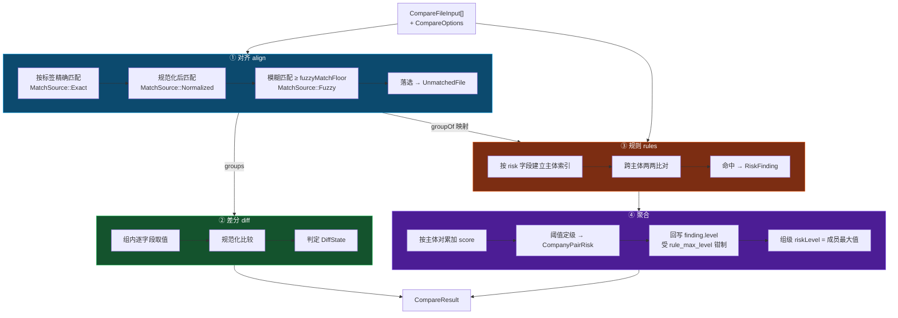
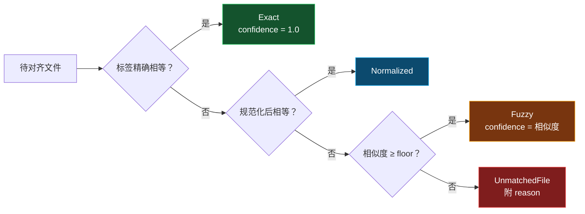
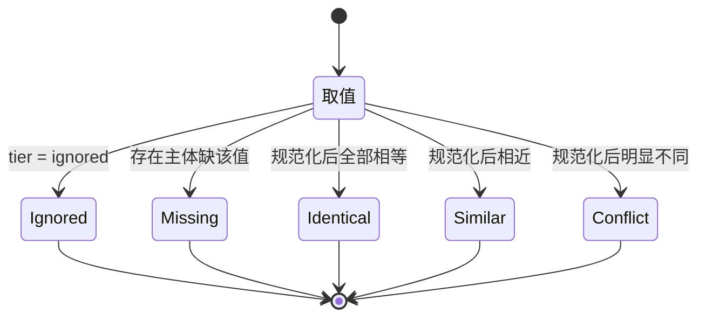
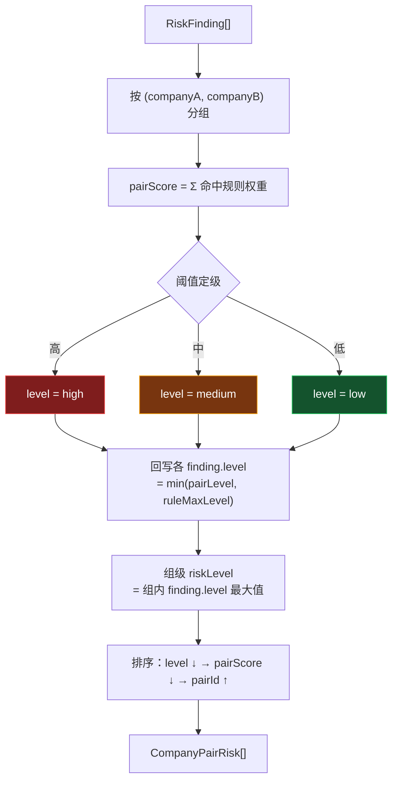
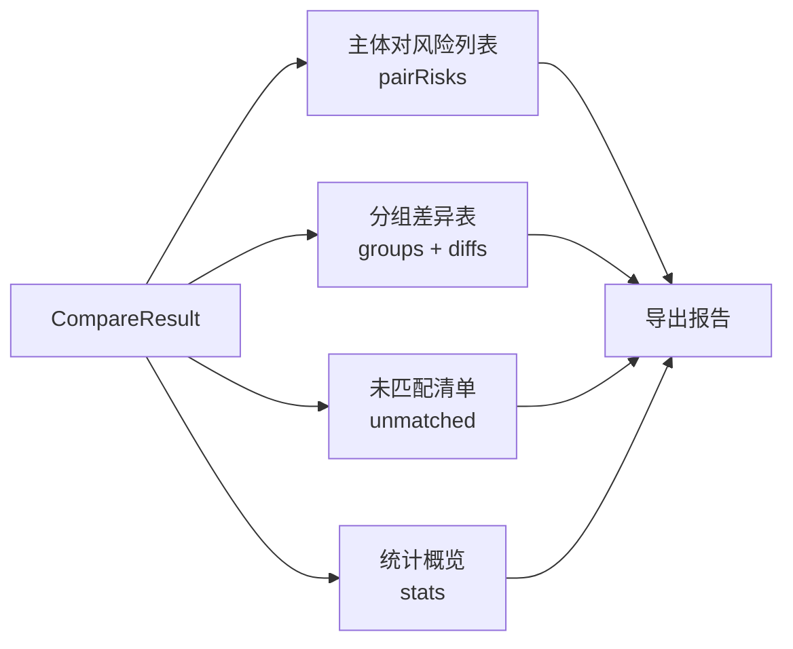

# 比对引擎

跨主体元数据比对的核心算法。入口 `documents::compare::run_compare`，位于 `src-tauri/src/documents/compare/mod.rs`。

> **合规前提**：引擎产出的是**线索**，不是结论。所有输出用语限定为「线索 / 疑似 / 需复核」，不做串标、违规、证据等定性表述。`CompareResult.disclaimer` 随结果一并下发。

## 模块构成

| 模块 | 职责 |
|------|------|
| `align.rs` | 把多主体的文件对齐成可横向比较的分组 |
| `diff.rs` | 组内逐字段差分 |
| `fields.rs` | 字段分级（risk / display / ignored）与停用词 |
| `normalize.rs` | 值规范化 |
| `rules.rs` | 8 条风险规则与主体对聚合 |
| `model.rs` | 数据模型 |

## 总体流程

## ① 对齐

目标：把「各家投标单位提交的同一份材料」放到同一组，才能横向比较。

三级降级策略保证「宁可不匹配，也不错匹配」：`fuzzyMatchFloor` 默认 `0.3`，低于阈值的文件进入 `unmatched` 并附上原因，交由人工判断，而不是硬塞进某个组。

`matchSource` 与 `matchConfidence` 一并输出，审核人可据此判断该组的可信度。`Manual` 预留给人工干预对齐。

组 ID 按顺序生成为 `g0001`、`g0002`……同时建立 `docId → groupId` 映射供规则阶段使用。

## ② 差分

组内每个字段收集所有主体的取值，比较后落成一个 `DiffState`：

统计口径：
- `diffCount` — 计入 `Conflict` 与 `Similar`
- `missingCount` — 计入 `Missing`
- `Identical` 与 `Ignored` 不计入差异

注意语义反转：在**比对场景**下，`Identical`（各家完全相同）反而是需要关注的信号，因为不同单位独立编制的文件不该在元数据上完全一致。差异统计服务于「找出哪里不一样」，而风险规则服务于「找出哪里一样得可疑」。

## ③ 规则

8 条规则，分为两类证据：

| 规则 ID | 证据类型 | 权重 | 等级上限 | 含义 |
|---------|---------|------|---------|------|
| `SAME_PERSON` | sameEntity | 50 | high | 作者 / 最后修改人相同 |
| `SAME_MANAGER` | sameEntity | 40 | high | 管理者相同 |
| `REVISION_TRACES` | sameEntity | 40 | medium | 批注 / 修订作者集合有交集 |
| `SAME_APP_COMPANY` | sameEntity | 35 | high | 文档内记录的单位相同 |
| `SAME_TEMPLATE` | sameOrigin | 30 | high | 模板相同 |
| `CLOSE_TIMESTAMP` | sameOrigin | 25 | medium | 创建 / 修改时间高度邻近 |
| `SIMILAR_APP_COMPANY` | sameEntity | 20 | medium | 单位名称相似 |
| `SAME_APP_FINGERPRINT` | sameOrigin | 5 | low | 办公软件版本相同 |

权重设计体现**鉴别力**差异：

- `SAME_PERSON`（50）最高——不同投标单位的文件由同一人编写，是最强的同源信号。
- `SAME_APP_FINGERPRINT`（5）最低且**恒为弱线索**——同一时期办公软件版本高度趋同，同版本是常态而非异常，仅作辅助参考。
- `REVISION_TRACES` 权重 40 但上限 `medium`——痕迹交叉指向性强，但可能源于正常的代编、咨询服务，须与其他线索交叉才有意义。

`rule_max_level` 对每条规则设等级上限：即使主体对总分很高，单条弱规则的 `level` 也不会被抬到超过自身上限，避免弱证据被强证据「带高」而误导审核。

规则可通过 `CompareOptions.ruleOverrides` 按 `ruleId` 覆盖启用状态与等级（内核已支持，UI 暂未暴露）。

### 停用词

`fields.rs` 维护多组停用词，避免无鉴别力的通用值触发误报：

| 停用词组 | 用途 |
|---------|------|
| `engine.compare.fields.stopWords` | 通用字段停用词 |
| `engine.compare.fields.templateStopWords` | 模板名停用词（如 `Normal.dotm`） |
| `engine.compare.fields.genericAuthors` | 通用作者名（如 `Administrator`、`user`） |
| `engine.compare.labels.stopWords` | 对齐标签停用词 |
| `engine.compare.folders.stopWords` | 目录名停用词 |

若不过滤，几乎所有 Windows 文档都会因作者为 `Administrator`、模板为 `Normal.dotm` 而互相命中，线索将完全失去价值。

## ④ 聚合

**主体对是定级的基本单位**，而非单条线索。单条线索孤立看往往不足为凭，多条不同类型的线索叠加才构成需要复核的信号。因此先按主体对累加总分并定级，再把等级回写到成员线索上。

回写时用 `min(pairLevel, ruleMaxLevel)` 钳制，保证弱规则不会被抬过其固有上限。

排序采用三级确定性比较（等级 → 分数 → ID），保证相同输入永远产出相同顺序，便于结果比对与回归测试。

`summary` 生成形如「A 与 B 命中 N 类线索，合计 M 分」，直接可用于报告。

## 输出消费

## 扩展点

| 需求 | 改动位置 |
|------|---------|
| 新增风险规则 | `rules.rs` 定义 `RuleMeta` 并加入 `ALL_RULES` |
| 调整权重 / 上限 | `rules.rs` 对应 `RuleMeta` 常量 |
| 新增比对字段 | `fields.rs` 注册字段与 tier |
| 调整规范化 | `normalize.rs` |
| 调整对齐策略 | `align.rs` |
| 补充停用词 | `fields.rs` 对应停用词组 |

新增规则时须同步确定：权重（相对鉴别力）、`max_level`（单条上限）、`EvidenceKind`（证据语义）、`explain` 文案（可复核性）。

## 相关文档

- [02-数据模型](./02-数据模型.md) — 结构定义
- [01-系统架构](./01-系统架构.md) — 引擎在系统中的位置
