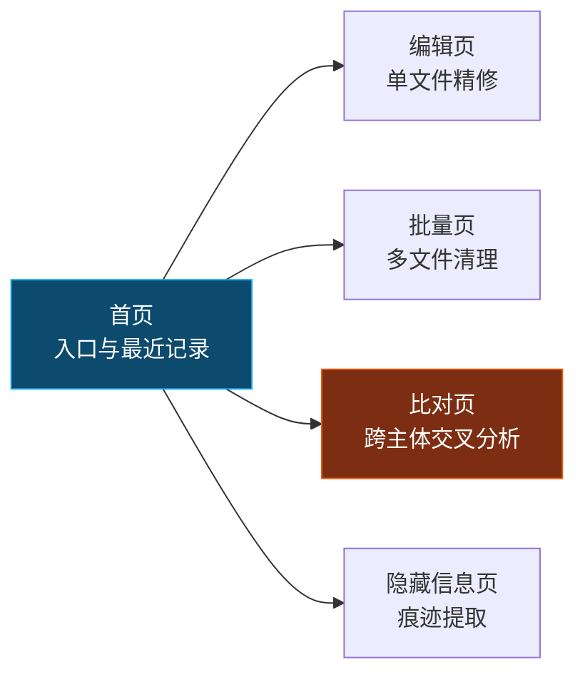
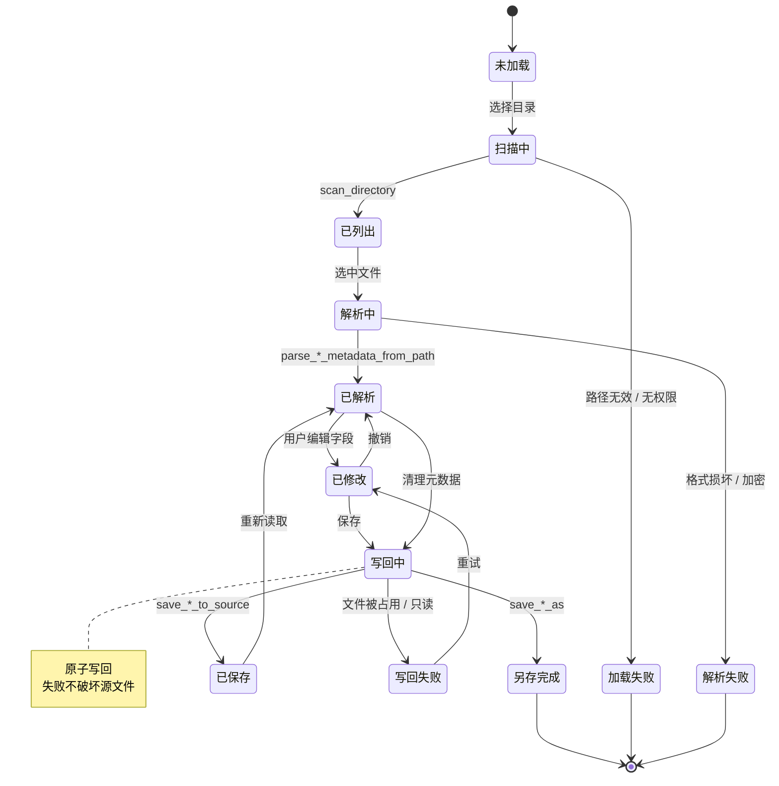
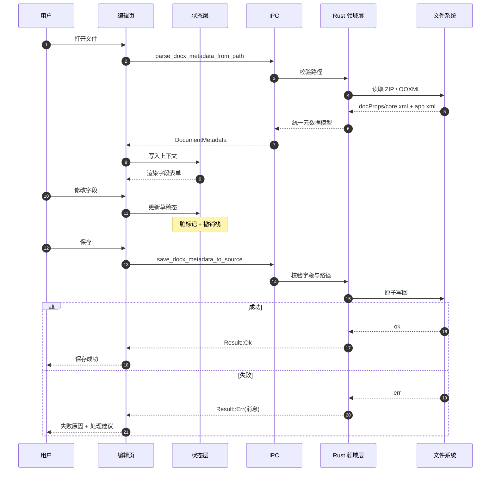
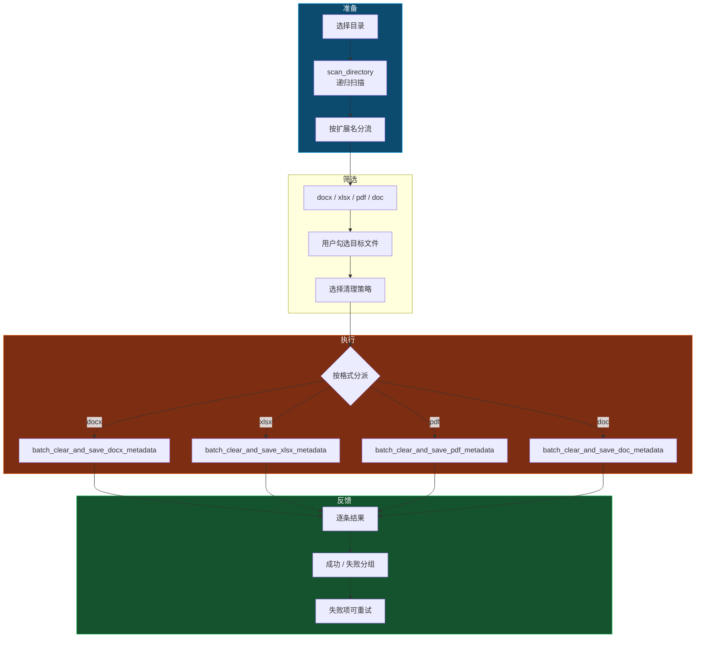
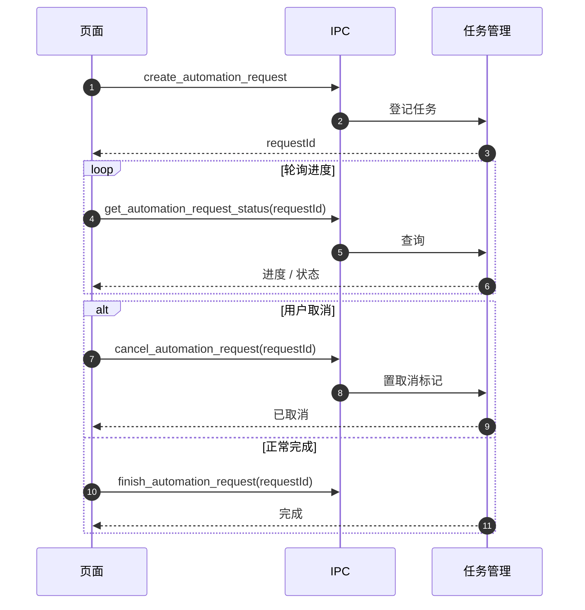
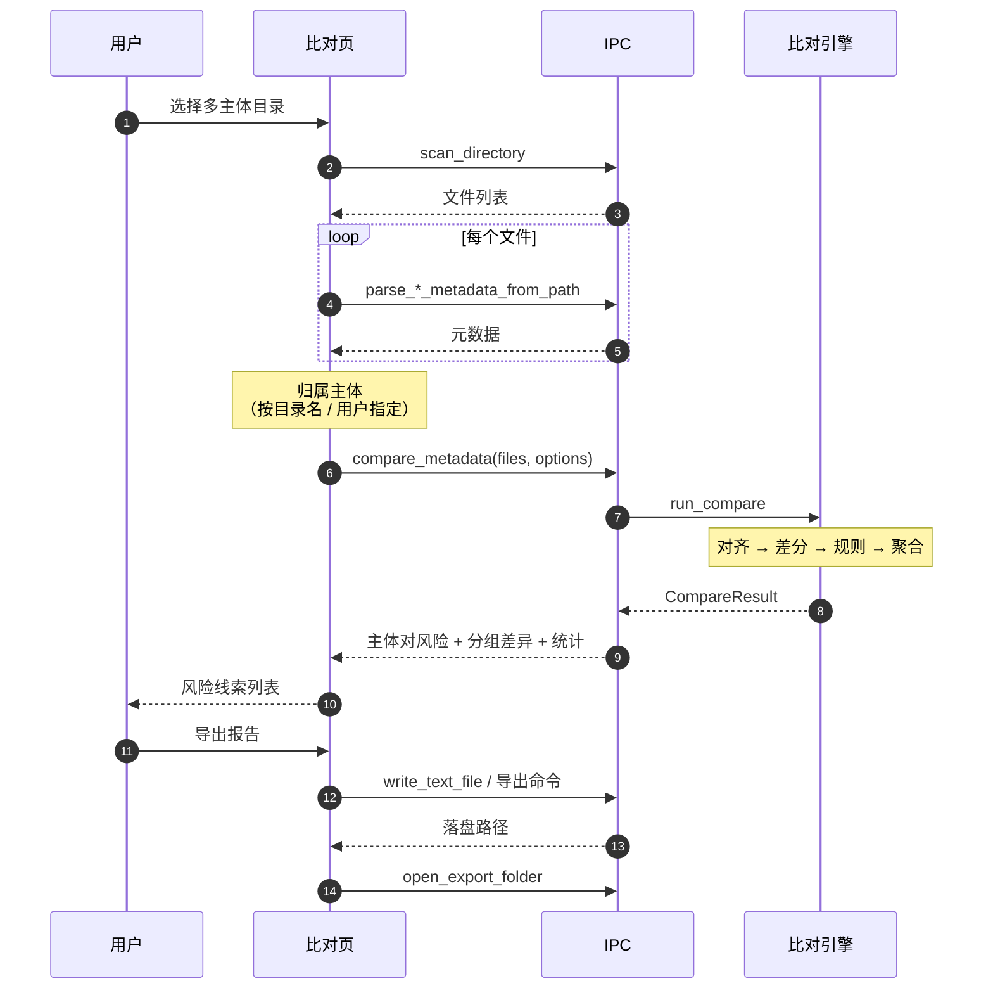
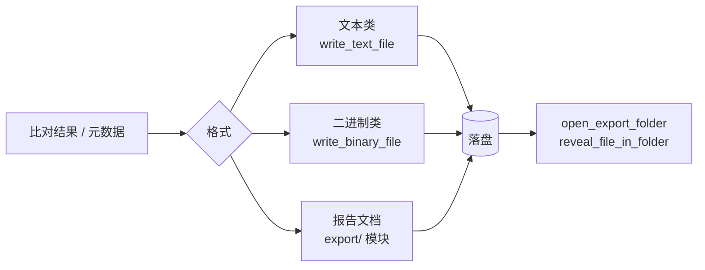

# 端到端流程

## 页面与能力映射

## 文档处理生命周期

## 单文件编辑流程

## 批量处理流程

批量命令按格式分派而非统一入口，因为四种格式的写回语义差异较大（OOXML 改 ZIP 条目、PDF 改 Info 字典与 XMP、DOC 改 OLE 流），强行抽象会让错误处理变得含糊。

批量操作**逐条返回结果**而非整体成功 / 失败，部分文件被占用或只读时，其余文件仍应正常处理。

## 长任务与中断

`create_automation_request` / `cancel_automation_request` / `finish_automation_request` / `get_automation_request_status` 四个命令构成可中断的长任务协议：

批量处理数百个文件时，用户必须能随时中止，且需要看到进度而非无反馈等待。

## 比对流程

## 导出

导出后主动提供「打开所在文件夹」与「在文件夹中显示」，避免用户找不到产物。

## 错误处理约定

所有命令返回 `Result<T, String>`，错误消息须包含**发生了什么 + 怎么解决**，而非裸堆栈：

| 场景 | 消息形态 |
|------|---------|
| 文件被占用 | 说明文件被其他程序打开，建议关闭后重试 |
| 只读文件 | 说明权限不足，建议改用「另存为」 |
| 格式损坏 | 说明无法解析，建议检查文件完整性 |
| 加密文档 | 说明受密码保护，建议先解除保护 |

前端所有 `await` 必须置于 `try/catch` 或 `.catch` 内，禁止裸 `await` 导致未处理的 rejection。

## 相关文档

- [05-IPC契约](./05-IPC契约.md) — 命令清单
- [03-比对引擎](./03-比对引擎.md) — 比对内部流程
