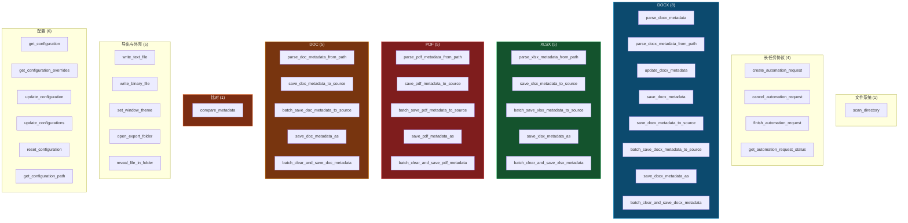
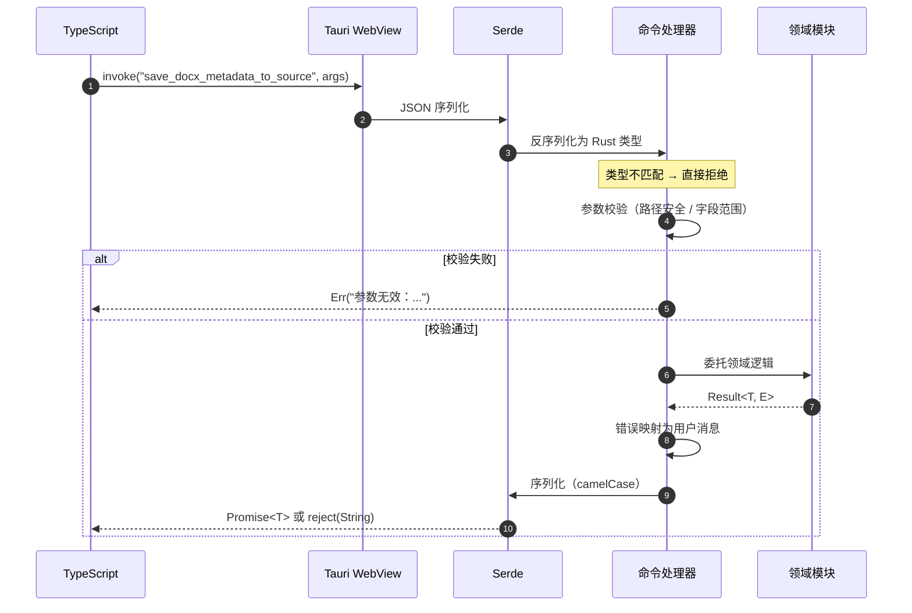
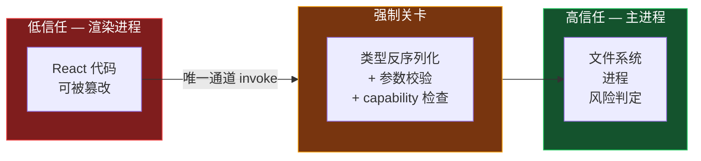

# IPC 契约

渲染进程与主进程之间唯一的通信通道。共 **39 个命令**，注册于 `src-tauri/src/lib.rs` 的 `tauri::generate_handler!`。

## 契约规则

1. 命令名 Rust 侧为 `snake_case`，前端 `invoke("命令名")` 使用**完全相同**的字符串，禁止 camelCase 漂移。
2. 参数与返回值字段为 `camelCase`（serde 自动转换）。
3. 统一返回 `Result<T, String>`，错误消息面向用户，含「发生了什么 + 怎么解决」。
4. 所有前端传入的参数在 Rust 命令内**重新校验**，不信任前端输入。
5. capability / permission 仅授予必要命令与最窄 scope。

## 命令全景



## 命令清单

### 文件系统

| 命令 | 用途 |
|------|------|
| `scan_directory` | 递归扫描目录，返回可处理的文档条目 |

### 长任务协议

| 命令 | 用途 |
|------|------|
| `create_automation_request` | 创建可中断的长任务，返回 requestId |
| `get_automation_request_status` | 查询任务进度与状态 |
| `cancel_automation_request` | 请求取消任务 |
| `finish_automation_request` | 标记任务完成并清理 |

### 格式命令矩阵

四种格式遵循同一组能力模式：

| 能力 | docx | xlsx | pdf | doc |
|------|:----:|:----:|:---:|:---:|
| 从路径解析 | ✅ | ✅ | ✅ | ✅ |
| 从字节解析 | ✅ | — | — | — |
| 内存更新 | ✅ | — | — | — |
| 保存（字节） | ✅ | — | — | — |
| 写回源文件 | ✅ | ✅ | ✅ | ✅ |
| 批量写回源文件 | ✅ | ✅ | ✅ | ✅ |
| 另存为 | ✅ | ✅ | ✅ | ✅ |
| 批量清理并保存 | ✅ | ✅ | ✅ | ✅ |

DOCX 多出 `parse_docx_metadata` / `update_docx_metadata` / `save_docx_metadata` 三个基于字节流的命令，用于不落盘的内存态处理。其余格式目前只提供基于路径的能力。

命令名模式：

```
parse_{fmt}_metadata_from_path
save_{fmt}_metadata_to_source
batch_save_{fmt}_metadata_to_source
save_{fmt}_metadata_as
batch_clear_and_save_{fmt}_metadata
```

新增格式时按此模式补齐 5 个命令即可接入既有页面。

### 比对

| 命令 | 入参 | 出参 |
|------|------|------|
| `compare_metadata` | `CompareFileInput[]` + `CompareOptions` | `CompareResult` |

详见 [03-比对引擎](./03-比对引擎.md)。

### 导出与外壳

| 命令 | 用途 |
|------|------|
| `write_text_file` | 写文本产物（报告、CSV、JSON） |
| `write_binary_file` | 写二进制产物（docx 报告等） |
| `set_window_theme` | 同步窗口主题（深 / 浅 / 跟随系统） |
| `open_export_folder` | 打开导出目录 |
| `reveal_file_in_folder` | 在文件管理器中定位文件 |

### 配置

| 命令 | 用途 |
|------|------|
| `get_configuration` | 读取生效配置 |
| `get_configuration_overrides` | 读取用户覆盖项 |
| `update_configuration` | 更新单项 |
| `update_configurations` | 批量更新 |
| `reset_configuration` | 重置为默认 |
| `get_configuration_path` | 返回配置文件路径 |

区分「生效配置」与「覆盖项」，使设置界面能显示哪些值是用户改过的、哪些是默认继承的，并支持精确重置。

## 调用时序



## 信任边界红线



禁止事项：

- 前端绕过 IPC 直接访问文件系统、进程、网络。
- 未定义 capability / permission 就假定拥有命令调用权。
- 把风险定级等敏感判定放在前端——渲染进程处于低信任边界，易被篡改。
- 忽略 CSP / isolation 加载未受控脚本。
- 命令层写业务算法——只做校验 + 委托 + 错误映射。

## 变更清单

修改 IPC 契约时须同步：

1. Rust 命令签名（`lib.rs` 或领域模块）
2. `generate_handler!` 注册项
3. TS 侧调用点与类型定义（`src/types/`）
4. capability 配置（若新增命令）
5. 本文档

## 相关文档

- [01-系统架构](./01-系统架构.md) — 信任边界设计
- [02-数据模型](./02-数据模型.md) — 流转的数据结构
- [04-端到端流程](./04-端到端流程.md) — 命令的调用场景
