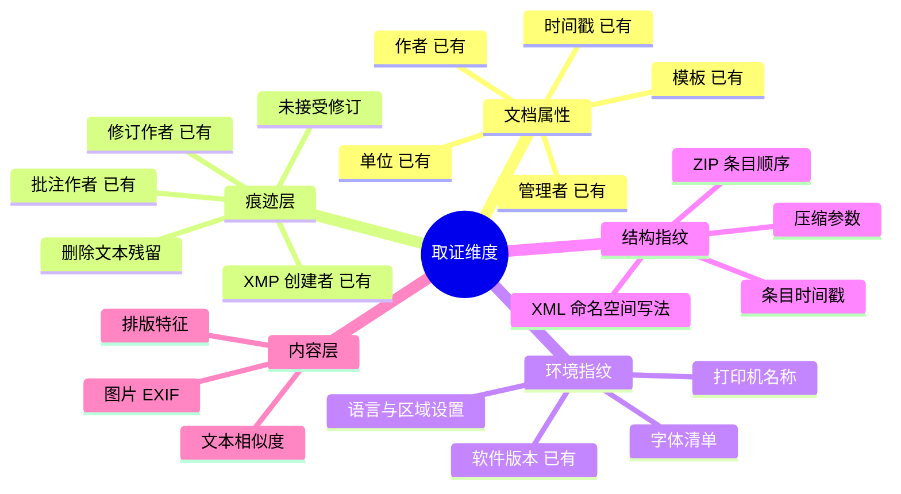
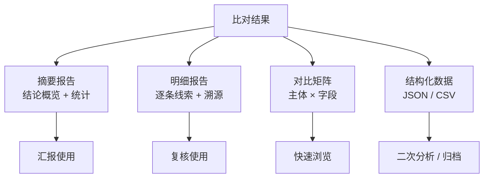

# Roadmap

工具的未来方向指南。本文档描述**方向与优先级判断依据**，不承诺交付时间。

## 产品定位

一句话：**本地优先的文档元数据取证与治理工具**。

两条主线：

- **治理线**（防泄露）— 帮助文档发布方清除元数据中的敏感痕迹。
- **取证线**（找线索）— 帮助审核方从多主体文件的元数据中发现同源迹象。

两条线共享同一套解析与写回内核，但用户、场景、评价标准完全不同。治理线追求「清得干净」，取证线追求「线索准确且可复核」。

## 现状盘点

| 能力 | 状态 |
|------|------|
| docx / xlsx / pdf / doc 解析与写回 | 已具备 |
| 单文件编辑、批量清理 | 已具备 |
| 隐藏痕迹提取（批注 / 修订 / XMP 作者） | 已具备 |
| 跨主体比对（8 条规则 + 主体对聚合） | 已具备 |
| 报告导出 | 已具备 |
| 规则可配置（权重 / 启用 / 等级） | 内核已支持，UI 未暴露 |
| 人工干预对齐（`MatchSource::Manual`） | 模型已预留，未实现 |

## 优先级框架

按三个维度排序候选方向：

1. **鉴别力增益** — 新增能力能否显著提升线索质量（取证线）或清理完整度（治理线）。
2. **本地可行性** — 是否能在不联网、不依赖外部服务的前提下完成。
3. **可复核性** — 产出能否被人工验证，而非黑箱判断。

任何牺牲第 3 点的方向都应降级——工具的价值建立在结论可被审核人复现之上。

## 方向一：扩展取证维度

当前规则集中在**文档属性层**（作者、单位、模板、时间戳）。业界取证实践关注的维度更广，以下为可补充的方向。

### 结构指纹（高价值）

OOXML 文件本质是 ZIP 容器。**ZIP 条目顺序、条目时间戳、压缩参数**由生成文档的软件与操作序列决定，不同机器上独立编制的文件极难在这些维度上完全一致。

这类特征的鉴别力可能高于软件版本号（当前权重仅 5），且完全可在本地计算。值得优先评估。

### 环境指纹（中价值）

`app.xml` 中的字体清单、打印机名称等反映制作环境。同一台机器产出的文档往往共享一套非常见字体或同一台打印机。

需注意误报：同一单位内的多台机器可能有统一装机镜像，需与其他线索交叉。

### 图片 EXIF（中价值）

嵌入文档的图片可能保留相机型号、拍摄时间、GPS 等信息。这既是取证线索，也是治理线的清理盲区——当前清理元数据可能未覆盖嵌入图片的 EXIF。

**治理线与取证线在此处是同一件事的两面**，实现一次可服务两条线。

### 内容相似度（需谨慎）

文本与排版相似度鉴别力强，但代价高：计算量大、易受模板影响产生误报、且已超出「元数据」的产品边界。

建议定位为**独立可选模块**而非核心能力，避免拖慢主流程与模糊产品定位。

## 方向二：规则产品化

内核已支持 `CompareOptions.ruleOverrides`，但 UI 未暴露。

不同行业、不同项目类型的元数据特征差异很大。固定权重必然在某些场景下偏保守或偏激进，让审核人按项目调参是必要的。

**规则预案**（可导出、可共享的规则集）能沉淀经验：某类项目适用什么参数，可以在团队间传递而非口口相传。

配套需求：调参后应能**立即看到影响**——同一批数据在新旧参数下的线索数量对比，避免盲调。

## 方向三：可复核性强化

这是取证工具的生命线。

| 能力 | 说明 |
|------|------|
| 线索溯源 | 点击线索直接跳转到原始字段值与文件位置 |
| 判定依据展开 | 展示规则的完整计算过程，而非仅结论 |
| 人工标注 | 支持标记「已核实为误报」并记入报告 |
| 手动对齐 | 实现 `MatchSource::Manual`，允许人工修正分组 |
| 结果快照对比 | 同一批文件在不同时间 / 参数下的结果差异 |

`RiskFinding` 已有 `explain` 与 `matchTag` 字段，基础设施到位，主要缺 UI 呈现。

**人工标注误报**尤其重要：审核人的判断应该被保留，而不是每次重新分析都要重新排除同样的误报。

## 方向四：报告体系

当前已有导出能力，可向「可直接进入工作流的产物」演进。

所有报告模板须内嵌 `disclaimer`，确保「线索非结论」的定性随产物流转，不因转发而丢失上下文。

## 方向五：格式覆盖

| 格式 | 优先级 | 理由 |
|------|:------:|------|
| `pptx` | 高 | OOXML 同源，复用现有 ZIP + docProps 逻辑，成本低 |
| `wps` / `et` / `dps` | 高 | 国内投标场景高频，且 WPS 元数据字段与 MS Office 有差异 |
| `odt` / `ods` | 中 | 开放格式，结构清晰 |
| `rtf` | 低 | 元数据能力有限 |
| 图片 EXIF | 中 | 见方向一 |

`pptx` 是最低垂的果实：与 docx / xlsx 共享 OOXML 结构，按 [05-IPC契约](./05-IPC契约.md) 的命令模式补齐 5 个命令即可接入既有页面。

WPS 系列在国内投标场景中占比高，且其写入的元数据字段与微软 Office 存在差异，若不专门适配可能遗漏线索。

## 方向六：工程健壮性

| 项 | 说明 |
|----|------|
| 大批量性能 | 数千文件场景下的内存与耗时控制，解析并行化 |
| 异常文档容错 | 加密、损坏、超大文件的降级处理，不中断整批 |
| 写回安全 | 原子写入 + 失败回滚，确保源文件永不损坏 |
| 回归测试集 | 构造覆盖各规则的样本集，防止调参引入回归 |
| 崩溃恢复 | 长任务中断后的续跑能力 |

**写回安全是不可妥协项**。工具会修改用户的原始文件，任何写回失败都不能导致文件损坏。

**回归测试集**是规则演进的前提：没有基准样本，每次调整权重都是在赌。

## 非目标

明确不做的方向，避免范围蔓延：

- **云端分析** — 违背本地优先原则。投标文件高度敏感，上传本身即风险。
- **自动定性结论** — 工具产出线索，定性由人做出。这既是合规要求，也是产品边界。
- **文档内容编辑** — 只处理元数据，不做正文编辑器。
- **实时协同** — 单机工具定位，不引入账户与同步。

## 演进路线

近期项的共同特征是**存量能力的兑现**——内核已支持但用户摸不到（规则覆盖、`explain` 字段、`MatchSource::Manual`）。这类投入产出比最高。

中期项聚焦鉴别力，其中结构指纹最值得先验证：完全本地可算，且可能显著优于现有的软件版本指纹。

## 决策原则

新增能力前先问四个问题：

1. 它服务治理线还是取证线？两条线的评价标准不同，混淆会导致设计走偏。
2. 它能否在本地完成？不能则重新设计或放弃。
3. 它的产出能否被人工复核？不能则不做。
4. 它会不会引入误报？会则须同步设计降噪手段（停用词、权重上限、交叉验证）。

## 相关文档

- [01-系统架构](./01-系统架构.md) — 扩展点所在层次
- [03-比对引擎](./03-比对引擎.md) — 规则扩展方式
- [05-IPC契约](./05-IPC契约.md) — 新增格式的命令模式
